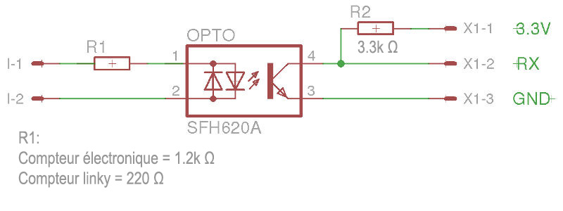
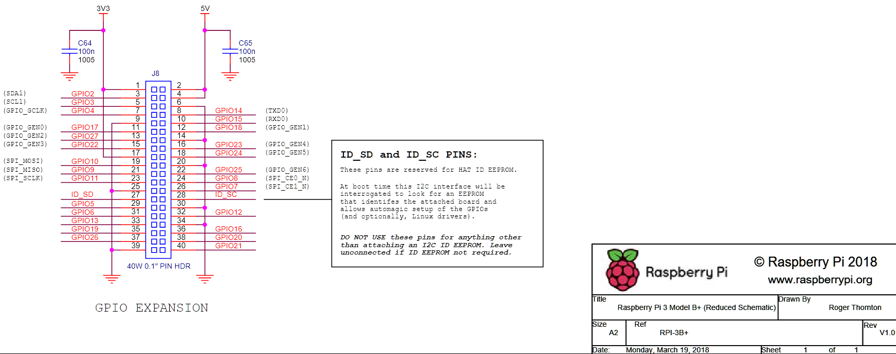

# Schéma de branchement Téléinfo

Ce schéma illustre le branchement réalisé pour la téléinformation entre le compteur et le Raspberry Pi.

Schéma réalisé par [Olivier - www.magdiblog.fr](https://www.magdiblog.fr/gpio/teleinfo-edf-suivi-conso-de-votre-compteur-electrique/)  

- I-1 et I-2 sont les bornes teleinfo du compteur électrique
- RX correspond à la broche 10 (GPIO15) du Raspberry Pi 3B+
- Vérifiez bien les connexions avant la mise sous tension.

---

## Raspberry Pi 3B+ GPIO

